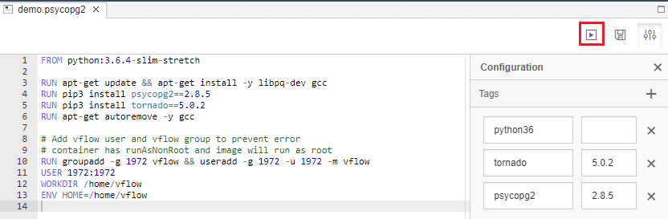
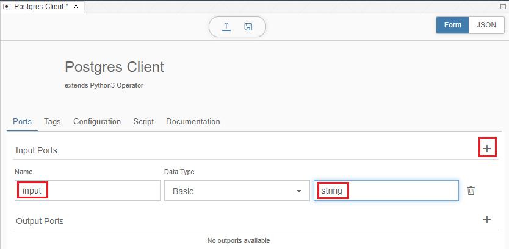
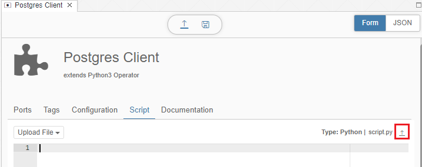
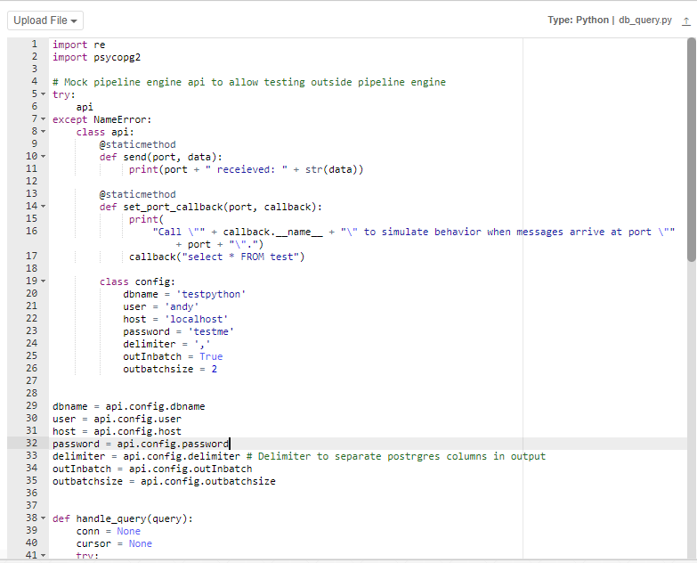
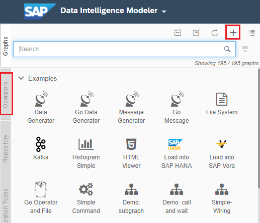
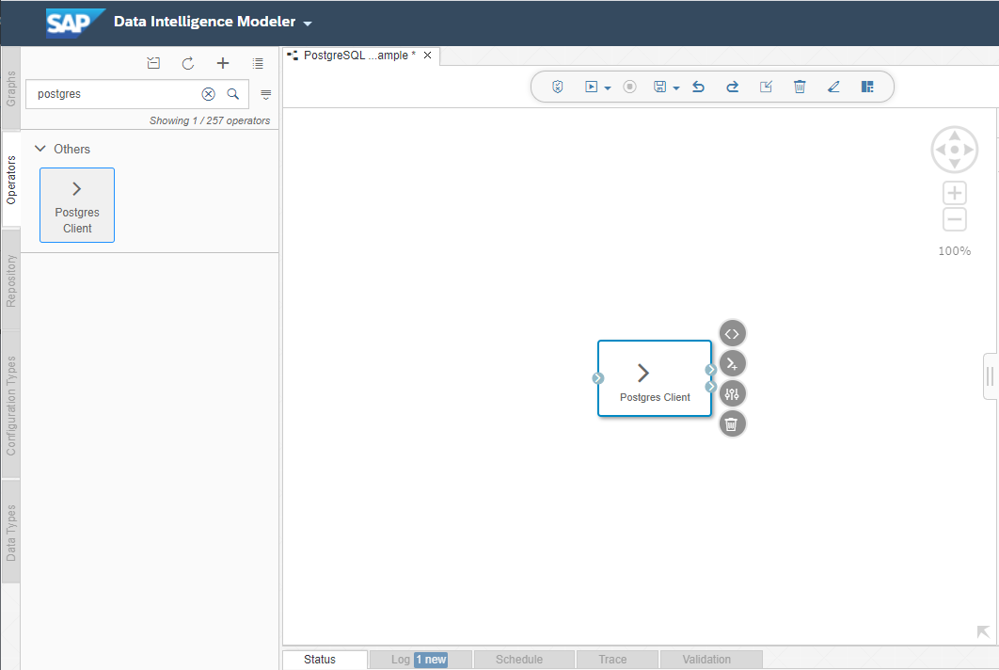

# Create a custome Postgres Operator
This blog makes a quick overview of developing a custom PostgreSQL client python operator for SAP Data Intelligence 3.0.
For more details on how to develop a custom operator, please read the blog by  [Jens Rannacher](https://blogs.sap.com/2018/01/23/sap-data-hub-develop-a-custom-pipeline-operator-with-own-dockerfile-part-3/)

## 1. Create a Dockerfile
The custom Postgres operator requires python library [Psycopg2](https://www.psycopg.org/) which is a PostgreSQL database adapter for Python. To use it, we need a custom Docker image that provides Python with that library. You can refer [creating dockerfiles](https://help.sap.com/viewer/aff95eebc2e04c44816e6ff0d21c3c88/3.0.latest/en-US/62d1df08fa384d0e88bbe9b7cbd2c3fb.html) for the detailed steps. 
- Open the **Repository** tab in the SAP Data Intelligence Modeler, navigate to the **dockerfiles** section, right-click and click on **Create Docker File**:


- Type in a **Name** for the Docker File, in our case we type "demo/psycopg2" and click **OK**:


A new tab opens where you can describe the details of the Dockerfile.
- In the Code Editor, paste the following Dockerfile instructions:

```
FROM python:3.6.4-slim-stretch

RUN apt-get update && apt-get install -y libpq-dev gcc
RUN pip3 install psycopg2==2.8.5
RUN pip3 install tornado==5.0.2
RUN apt-get autoremove -y gcc

# Add vflow user and vflow group to prevent error
# container has runAsNonRoot and image will run as root
RUN groupadd -g 1972 vflow && useradd -g 1972 -u 1972 -m vflow
USER 1972:1972
WORKDIR /home/vflow
ENV HOME=/home/vflow
```

Next, provide tags for the Docker image to describe its properties:
- Open the Docker File Configuration Pane by clicking on the icon in the upper right corner:


- Add new **Tags** by clicking on the "**+**" icon:


- Add the **Tag** "python36": We use this tag to declare that our Docker image includes Python version 3.6.
- Add the **Tag** “tornado” with version 5.0.2 as this is required by the updated Python Subengine.
- Add the **Tag** “psycopg2” with version 2.8.5: We use this tag to declare that the Python library psycopg2 is available in the Docker image.
- Save the Dockerfile by clicking on Save in the upper right corner:


- Build the Docker Image by clicking on the Build icon in the upper right side:



You can monitor the status of the Docker build process from the **Log** tab in the bottom pane:


Once finished, the final build status will be updated:


> The successfully built image will be pushed to the local Docker registry that was configured during installation of SAP Data Intelligence.

## 2. Create a custom Operator using the Docker Image
### 2.1. Create the Operator
You can use the SAP Data Intelligence Modeler to create your own operators and execute them in the graphs. The Modeler provides a form-based editor to create operators. Please refer to [Creating Operators](https://help.sap.com/viewer/aff95eebc2e04c44816e6ff0d21c3c88/3.0.latest/en-US/049d2f3cc69c4281a3f4570c0d2d066e.html) for the detailed steps.
- Open the **Repository** tab in the SAP Data Intelligence Modeler, navigate to the **operators** section, right-click and click on **Create Operator**:


- In the **Name** text field, provide the name "demo.postgresclient" for the new operator.
- In the **Display Name** text field, provide the display name "Postgres Client" for the operator.
- In the Base Operator dropdown list, select the "Python3 Operator":


- Choose **OK**.

The tool opens the form-based Operator Editor Window:


### 2.2. Define the Input and Output Ports
- Add an **Input Port** with the name "input" of type "string":



This port will be used later to pass a SQL statememt string to the operator and to trigger a Postgres database table query.

- Add two **Output Ports** with the name "output" and "debug", both of the same type "string":


The "output" port will be used later to send the SQL query result and the "debug" port will be used to send debug messages, such as error messages.

### 2.3. Define Tags
The **Tags** describe the runtime requirements of the operator and allow to force the execution in a specific Docker image instance whose **Docker file** was annotated with the same **Tag** and **Version**.

In our case, we require Python version 3.6 and the Python library "psycopg2" which is not included in the Python standard library. Both are provided by the Dockerfile which we have created before.

- In the **Tags** section, choose **+** (Add tag) and choose the tag “python36”, the tag "tornado" with version "5.0.2" and the tag "psycopg2" with version "2.8.5".


### 2.4. Provide the Operator Configuration
In the **Configuration** section, you can find already one Parameter "codelanguage" that was inherited from the Python3Operator. It is not possible to remove the inherited Parameters, but you can change their default values.

- Add seven additional **Parameters** that we will later use to control the behavior of the operator during runtime:

Name | Title | Description | Type | Format | Required | Default-Value |
---|---|---|---|---|---|---|
host | Database host | Database host | string | None | Yes | remotehost |
dbName | Database Name | Database Name | String | None | Yes | test |
user | Database User | Database User| string | None | Yes | test |
password | Database Password | Database Password | string | Yes | Password |
delimiter | Column Delimiter | Column Delimiter in output | string | None | Yes | , |
outInbatch  | Output in batch | Output in batch | Boolean | | Yes | False |
outbatchsize | Output batch size (rows) | Output batch size in rows | Integer | | No | 10 |

For the outbatchsize Parameter, we also set its Visibility property as below:


This ensures the option only appear in the operator configuration UI if outInbatch value is true.


### 2.5. Define the Operator Script
In the **Script** section, you can provide your own Python script in two different ways:
1. **Inline Editor**: The code can be written directly into the Script Editor which stores the code together (inline) with the operator definition in the repository. This is the preferred way in cases where you only want to write small scripts that do not require external testing.
2. **Upload File**: You can upload a Python script as a file which is then stored side-by-side with the Operator in the Repository and referenced in the Operator definition. This is the preferred way in cases where you plan to integrate more-complex application logic in Python language which shall also be testable externally, e.g. by accessing the Python script on disk.

In this example, we go for option (2) and upload a file containing a Python script.

- Click on the **Inline Editor** in the Script section and then click on **Upload File** in the drop-down menu:


This will by default reference and create a file **script.py** in the Repository as shown on the right side of the Script editor. All the code written into the Script  Editor will end up in this script which can be accessed from the Repository or disk.

In our case, we will create an own Python script locally and upload this to the Repository via the Script Editor.

- Open an Editor of your choice, e.g. Notepad, paste the following Python code and save it as a file called “db_query.py”:

```
import re
import psycopg2

# Mock pipeline engine api to allow testing outside pipeline engine
try:
    api
except NameError:
    class api:
        @staticmethod
        def send(port, data):
             print(port + " receieved: " + str(data))

        @staticmethod   
        def set_port_callback(port, callback):
             print(
                 "Call \"" + callback.__name__ + "\" to simulate behavior when messages arrive at port \"" + port + "\".")
             callback("select * FROM test")

        class config:
            dbName = 'testpython'
            user = 'andy'
            host = 'localhost'
            password = 'testme'
            delimiter = ','
            outInbatch = True
            outbatchsize = 2


dbname = api.config.dbName
user = api.config.user
host = api.config.host
password = api.config.password
delimiter = api.config.delimiter # Delimiter to separate postrgres columns in output
outInbatch = api.config.outInbatch
outbatchsize = api.config.outbatchsize


def handle_query(query):
    conn = None
    cursor = None
    try:
        # Connect to an existing database
        connect_str = "dbname=" + dbname + " " + \
            "user=" + user + " " + \
            "host=" + host + " " + \
            "password=" + password
        conn = psycopg2.connect(connect_str)
        
        # Open a cursor to perform database operations
        cursor = conn.cursor()
        cursor.execute(query)

        outStr = ""
        rows = []
        if not outInbatch:
            rows = cursor.fetchall()
            for r in rows:
                for i, c in enumerate(r):
                    outStr += str(c) + \
                        ('' if i==len(r)-1 else delimiter)
                outStr += "\n"
            api.send("output", outStr)
        else:
            rows = cursor.fetchmany(outbatchsize)
            while(rows):
                for r in rows:
                    for i, c in enumerate(r):
                        outStr += str(c) + \
                            ('' if i==len(r)-1 else delimiter)
                    outStr += "\n"
                api.send("output", outStr)
                outStr = ""
                rows = cursor.fetchmany(outbatchsize)
    except Exception as e:
        api.send("debug", str(e))
    finally:
        if(cursor):
            cursor.close()
        if(conn):
            conn.close()


# Interface for integrating the postgres query function into the pipeline engine
def on_input(data):
    if data:
        m = re.match(r'\s*select', data, flags=re.IGNORECASE)
        if m:
            handle_query(data)
        else:
            api.send("debug", "Only support SELECT Statement.")
    else:
        api.send("debug", "Input is empty.")


# Triggers the request for every message (the message provides the query)
api.set_port_callback("input", on_input)
```
The script mocks the Python pipeline API, which allows to use and test the Python script externally. 

- Click the upload button on the right side of the Script Editor:



- Choose the file "db_query.py" from your local disk where you have stored it, e.g.:


The Pipeline Modeler uploads the file to the Repository, references the script in the Operator definition and shows the content in the Script Editor:



When you now change the code in the Script Editor, it will be changed in the db_query.py file, although it appears like an inline script.

### 2.6. Modify the Operator Display Icon
A default operator display icon is used when you create a custom operator. You can change the icon within the tool or upload your own icon in Scalable Vector Graphics (SVG) format.
- In the Operator editor, click the operator’s default icon:


- In the Icon dropdown list, select the wanted icon, in our case we choose “angle-right”:


- Click OK.

The tool uses the new icon for operators when it displays the operator in the Pipeline editor:


### 2.7. Maintain Documentation for the Operator
- In the Documentation section, you can write the documentation in Markdown language.


We fill its content like below:

```
Postgres Client Operator
===========

This operator accepts the select query statement for a given postgreSQL database table and output the result.

Configuration parameters
------------

- **host** (type string): The databse hostname
- **dbname** (type string): The database name
- **user** (type string): The User name for acccessing the database
- **password** (type string): The password for the given user
- **delimiter** (type string): The delimiter to separate columns of a row in operator output
- **outInbatch** (type Boolean): Option for Output in batch
- **outbatchsize** (type Integer): Output batch size in rows if outInbatch is True.

Input
------------
- **input** (type string): The database query statement

Output
------------
- **output** (type string): The query result
- **debug** (type string): Debug messages

```

### 2.8. Save the Operator:
In the editor toolbar, click the Save-icon to save the operator:


### 2.9 Explore the Repository Content
Now, the operator is created. We can check its conent in the **Repository** tab in the SAP Data Intelligence Modeler:


## 3. Use the Operator in a Pipeline
Now, let's create a pipeline to test the operator we created above.

### 3.1 Create a Pipeline (Graph)
- In the navigation pane on left side, choose the Graphs tab and click on the + icon to create a new Pipeline (Graph):



The tool opens the Graph Editor where pipelines can be modeled by adding and connecting predefined operators:


- Click on the Disk-icon to save the Pipeline:


- Provide the **Name** “PostgresQueryExample” and the **Description** “PostgreSQL Query Example” and click OK:


### 3.1 Add the custom Postgres Client Operator
- Open the **Operators** tab in the navigation pane on the left and search for the **Postgres Client** by typing the name into the **Search** field:


- Add the **Postgres Client** to the pipeline by drag & drop into the Graph Editor:



- You can view the documentation of the operator by first right-clicking on the operator and then by clicking on **Open Documentation**:


- Next, open the Configuration of the operator again via right click:


- In the **Configuration**, fill all the appropriate configuration information:


### 3.2 Add a Terminal Operator
- Next, add a **Terminatl operator**, connect its output port to the input port of the Postgres Client Operator. Also, connect the debug port of the Postgres Client Operator to the Terminatl operator's input port. This setting will allow us to send the sql query statment to Postgres Client Operator and receieve the debug messages interactively.


### 3.3 Add a Wiretap  Operator
- Finally, add a **Wiretap operator**, connect the output port of the Postgres Client Operator to the Wiretap operator's input port. The Wiretap operator will show the query result.


- You have now finalized the pipeline. Click again [CTRL] + [S] to save and update the pipeline in the repository.

## 4. Run the Pipeline
Now we can run the pipeline and test the query function of the Postgres Client Operator.

- Click the **Run** button:


Initially, the pipeline is in a pending state. In this state, the pipeline is being prepared for execution. It remains in this state until either an error occurs, or state of all subgraphs in the pipeline is running.

- After the pipeline entering into a running state, Open the **Wiretap** UI via **Right click -> Open UI**:


There is nothing ouptput since we have not run the query yet:


- Open the **Terminal** via **Right click -> Open UI**:


The browser opens the terminal, it is waititng for enter the query:


- Enter the quey statement in the **Terminal** like below:


Please adapt the table name to your own. Now the query is sending to downstream operator.

- Observe the **Wiretap** UI, you can see the below output:


- Enter an empty quey statement in the **Terminal** like below:


Notice the debug mesage shows the input is empty.

Congratulations, you have learned how to create a custom opeator, and build a data pipeline to use that opeator.


