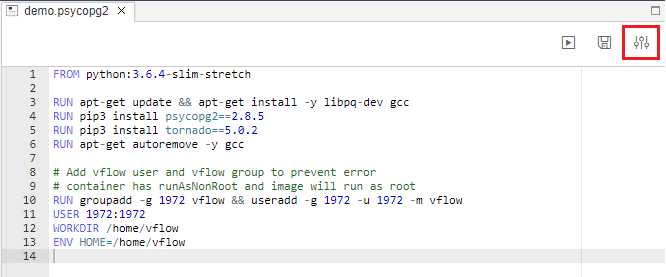
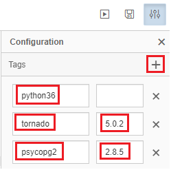
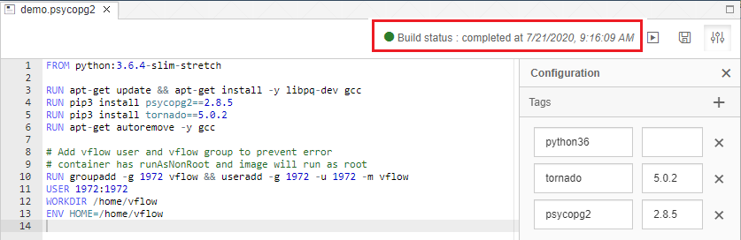
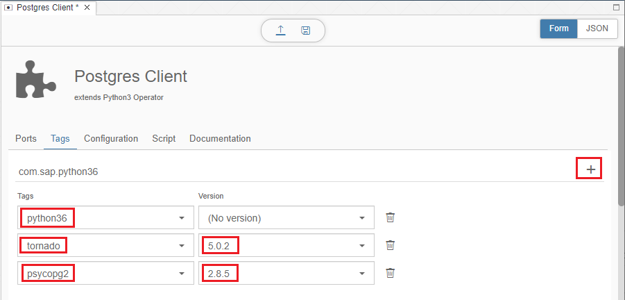

# Create a custome Postgres Operator
This blog makes a quick overview of developing a custom PostgreSQL client python operator for SAP Data Intelligence 3.0.
For more details on how to develop a custom operator, please read the blog by  [Jens Rannacher](https://blogs.sap.com/2018/01/23/sap-data-hub-develop-a-custom-pipeline-operator-with-own-dockerfile-part-3/)

## 1. Create a Dockerfile
The custom Postgres operator requires python library [Psycopg2](https://www.psycopg.org/) which is a PostgreSQL database adapter for Python. To use it, we need a custom Docker image that provides Python with that library. You can refer [creating dockerfiles](https://help.sap.com/viewer/aff95eebc2e04c44816e6ff0d21c3c88/3.0.latest/en-US/62d1df08fa384d0e88bbe9b7cbd2c3fb.html) for the detailed steps. 
- Open the **Repository** tab in the SAP Data Intelligence Modeler, navigate to the **dockerfiles** section, right-click and click on **Create Docker File**:


- Type in a **Name** for the Docker File, in our case we type "demo/psycopg2" and click **OK**:


A new tab opens where you can describe the details of the Dockerfile.
- In the Code Editor, paste the following Dockerfile instructions:

```
FROM python:3.6.4-slim-stretch

RUN apt-get update && apt-get install -y libpq-dev gcc
RUN pip3 install psycopg2==2.8.5
RUN pip3 install tornado==5.0.2
RUN apt-get autoremove -y gcc

# Add vflow user and vflow group to prevent error
# container has runAsNonRoot and image will run as root
RUN groupadd -g 1972 vflow && useradd -g 1972 -u 1972 -m vflow
USER 1972:1972
WORKDIR /home/vflow
ENV HOME=/home/vflow
```

Next, provide tags for the Docker image to describe its properties:
- Open the Docker File Configuration Pane by clicking on the icon in the upper right corner:



- Add new **Tags** by clicking on the "**+**" icon:



- Add the **Tag** "python36": We use this tag to declare that our Docker image includes Python version 3.6.
- Add the **Tag** “tornado” with version 5.0.2 as this is required by the updated Python Subengine.
- Add the **Tag** “psycopg2” with version 2.8.5: We use this tag to declare that the Python library psycopg2 is available in the Docker image.
- Save the Dockerfile by clicking on Save in the upper right corner:


- Build the Docker Image by clicking on the Build icon in the upper right side:


You can monitor the status of the Docker build process from the **Log** tab in the bottom pane:


Once finished, the final build status will be updated:



> The successfully built image will be pushed to the local Docker registry that was configured during installation of SAP Data Intelligence.

## 2. Create a custom Operator using the Docker Image
### 2.1. Create the Operator
You can use the SAP Data Intelligence Modeler to create your own operators and execute them in the graphs. The Modeler provides a form-based editor to create operators. Please refer to [Creating Operators](https://help.sap.com/viewer/aff95eebc2e04c44816e6ff0d21c3c88/3.0.latest/en-US/049d2f3cc69c4281a3f4570c0d2d066e.html) for the detailed steps.
- Open the **Repository** tab in the SAP Data Intelligence Modeler, navigate to the **operators** section, right-click and click on **Create Operator**:


- In the **Name** text field, provide the name "demo.postgresclient" for the new operator.
- In the **Display Name** text field, provide the display name "Postgres Client" for the operator.
- In the Base Operator dropdown list, select the "Python3 Operator":


- Choose **OK**.

The tool opens the form-based Operator Editor Window:


### 2.2. Define the Input and Output Ports
- Add an **Input Port** with the name "input" of type "string":


This port will be used later to pass a SQL statememt string to the operator and to trigger a Postgres database table query.

- Add two **Output Ports** with the name "output" and "debug", both of the same type "string":


The "output" port will be used later to send the SQL query result and the "debug" port will be used to send debug messages, such as error messages.

### 2.3. Define Tags
The **Tags** describe the runtime requirements of the operator and allow to force the execution in a specific Docker image instance whose **Docker file** was annotated with the same **Tag** and **Version**.

In our case, we require Python version 3.6 and the Python library "psycopg2" which is not included in the Python standard library. Both are provided by the Dockerfile which we have created before.

- In the **Tags** section, choose **+** (Add tag) and choose the tag “python36”, the tag "tornado" with version "5.0.2" and the tag "psycopg2" with version "2.8.5".



### 2.4. Provide the Operator Configuration
In the **Configuration** section, you can find already one Parameter "codelanguage" that was inherited from the Python3Operator. It is not possible to remove the inherited Parameters, but you can change their default values.

- Add seven additional **Parameters** that we will later use to control the behavior of the operator during runtime:

Name | Title | Description | Type | Format | Required | Default-Value |
---|---|---|---|---|---|---|
host | Database host | Database host | string | None | Yes | remotehost |
dbName | Database Name | Database Name | String | None | Yes | test |
user | Database User | Database User| string | None | Yes | test |
password | Database Password | Database Password | string | Yes | Password |
delimiter | Column Delimiter | Column Delimiter in output | string | None | Yes | , |
outInbatch  | Output in batch | Output in batch | Boolean | | Yes | False |
outbatchsize | Output batch size (rows) | Output batch size in rows | Integer | | No | 10 |

For the outbatchsize Parameter, we also set its Visibility property as below:


This ensures the option only appear in the operator configuration UI if outInbatch value is true.

